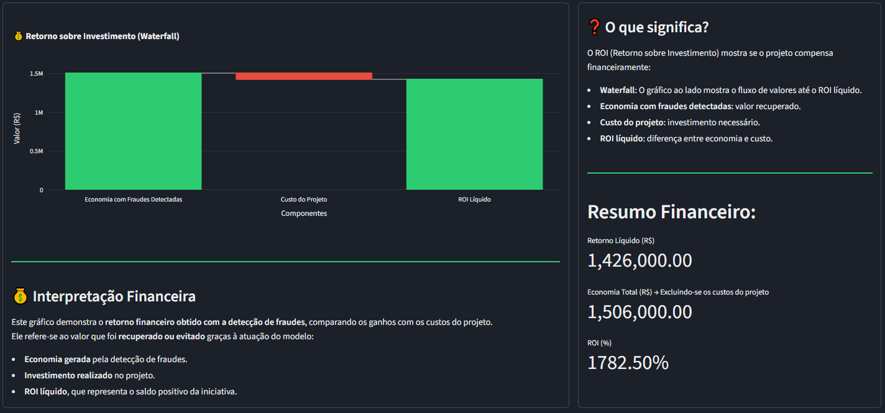
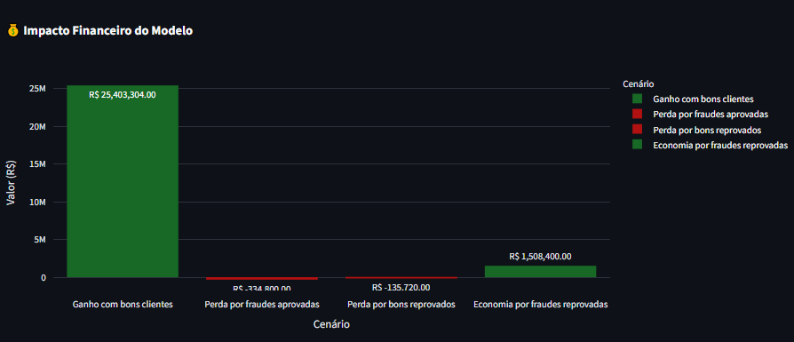
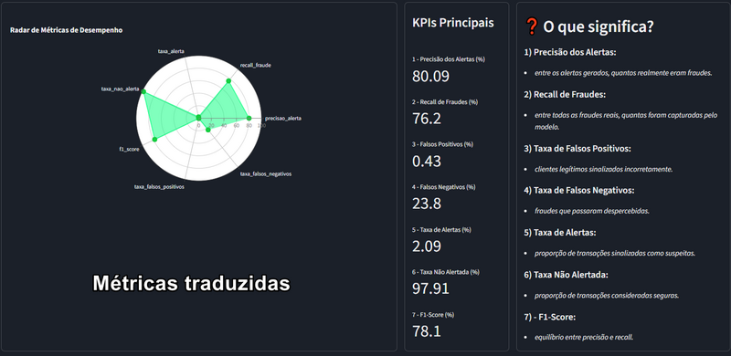
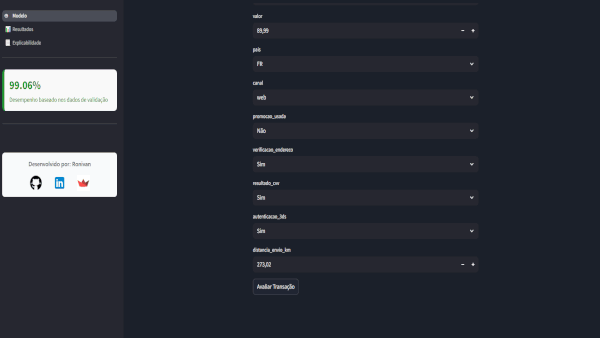
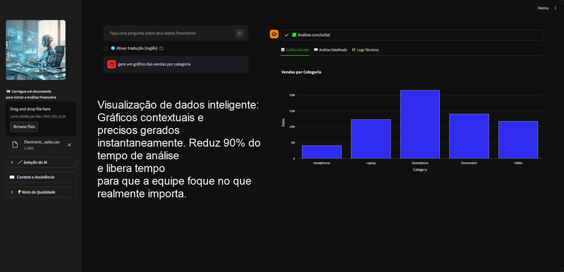
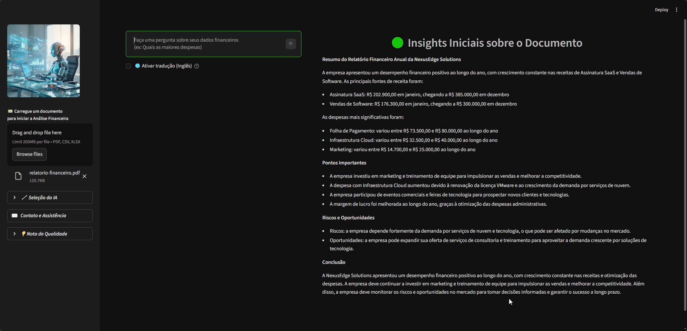
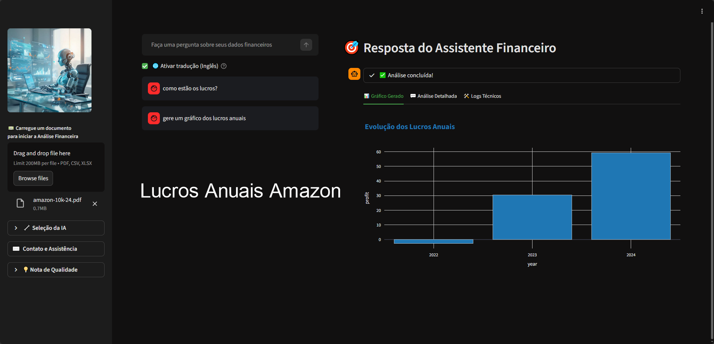
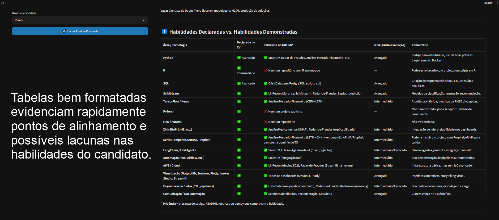
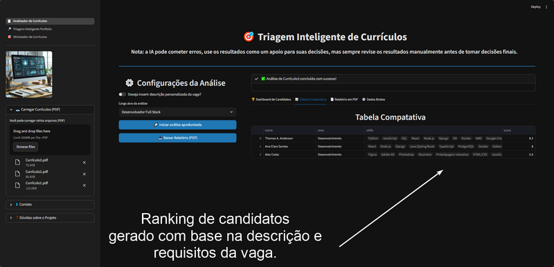
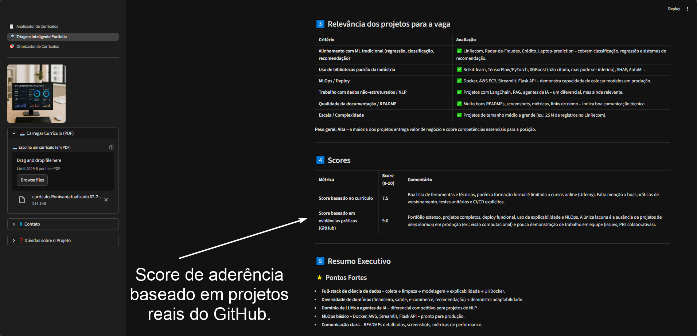

# 👋 Olá, sou Ronivan Zorzan Barbosa!

Sou **Cientista de Dados** especializado em **Machine Learning, NLP e IA Generativa**. Transformo dados complexos em soluções estratégicas, desde a coleta e limpeza até a implementação de modelos em produção e deploy em cloud.

  <a href="mailto:ronizorzan1992@gmail.com" class="btn">Entre em Contato</a>

---

## 📌 Sobre Mim

- **🎯 Objetivo**: Contribuir para times de tecnologia em empresas de **fintech, saúde ou e-commerce**, desenvolvendo modelos escaláveis e interpretáveis.
- **💡 Habilidades**: Python, SQL, Machine Learning, AWS, Git/GitHub, comunicação de insights e documentação técnica.
- **🔗 Links**: [LinkedIn](https://linkedin.com/in/ronivan-zorzan-barbosa) | [GitHub](https://github.com/Ronizorzan) | [E-mail](mailto:ronizorzan1992@gmail.com)

---

## 🚀 Projetos

### 1. [Detecção de Fraudes em Transações Digitais](https://github.com/Ronizorzan/deteccao-fraudes)
**Tecnologias**: Python, Scikit-learn, XGBoost, Pandas, Matplotlib

  
  
  
  

- Desenvolvi um **modelo de classificação** com XGBoost para detectar fraudes, alcançando **76.2% de recall** e **F1-score de 78.1%**. 
- **Impacto**: Redução de perdas financeiras com um **ROI de 1700%**. 
- **Desafio**: Dados desbalanceados resolvidos com técnicas de **oversampling (SMOTE)**.

### 2. [Assistente Financeiro Automatizado](https://github.com/Ronizorzan/assistente-financeiro)
**Tecnologias**: Python, Pandas, Plotly, AWS EC2, SQL

  
  
  

- Criei uma solução de **Business Intelligence** para analisar relatórios financeiros (PDFs/CSVs) e gerar **visualizações automáticas** com Plotly.
- **Impacto**: Redução de **80% no tempo de processamento** de documentos financeiros.
- **Deploy**: Implantei o projeto em uma **instância AWS EC2** e documentei o fluxo de trabalho no GitHub.

---

### 3. [SmartCV](https://github.com/Ronizorzan/SmartCV)
**Tecnologias**: Python, NLP, Hugging Face, LangChain, RAG

  
  
  

- Desenvolvi uma **ferramenta de análise de currículos** usando **NLP e LLMs** para extrair insights e automatizar a triagem de candidatos.
- **Impacto**: Redução de **70% no tempo de triagem** de currículos e melhoria na qualidade das contratações.
- **Tecnologias**: Utilizei **Hugging Face, LangChain e RAG** para processar e analisar documentos em PDF e texto.

---

## 🛠️ Habilidades Técnicas

| Categoria               | Habilidades                                                                                     |
|-------------------------|-------------------------------------------------------------------------------------------------|
| **Linguagens**          | Python (Avançado), SQL (Avançado), R (Básico)                                                  |
| **Modelagem Estatística** | Regressão, Classificação, Clustering (Scikit-learn, XGBoost, TensorFlow, Keras)               |
| **Análise de Dados**    | EDA, Limpeza de Dados, Visualização (Pandas, Matplotlib, Plotly, Seaborn)                      |
| **Cloud & Deploy**      | AWS (S3, EC2, Lambda), Docker, Flask                                                            |
| **MLOps**               | Git, DVC, MLFlow, Airflow                                                                      |
| **NLP**                 | Hugging Face, LangChain, RAG, Fine-tuning de LLMs                                              |
| **Ferramentas**         | Git/GitHub, Jupyter Notebook, VS Code, Excel Avançado                                          |

---

## 🎓 Formação Acadêmica

### Engenharia de IA Generativa (Em andamento – Previsão: 12/2026)
**Udemy** | Carga horária: +100h
- **Disciplinas**: Modelagem estatística, NLP, LLMs, RAG, fine-tuning de modelos, AWS (S3, Lambda, EC2).
- **Projeto**: Desenvolvi um **assistente financeiro automatizado** usando RAG e LLMs para analisar relatórios em PDF/CSV.

### Formação em Ciência de Dados
**Udemy** | Conclusão: 07/2024 | Carga horária: 47h
- **Disciplinas**: Python para Data Science, SQL, EDA, modelagem estatística (Scikit-learn, XGBoost, TensorFlow).

---

## 🚀 Cases de Sucesso

### 1. **Otimização de Processos em Fintech**
- **Desafio**: Reduzir o tempo de processamento de transações em 50%.
- **Solução**: Implementei um pipeline de dados automatizado usando **AWS Lambda e Python**, reduzindo o tempo de processamento em **60%**.
- **Impacto**: Economia de **$50.000/ano** em custos operacionais.

### 2. **Melhoria na Triagem de Currículos**
- **Desafio**: Automatizar a triagem de currículos para uma empresa de recrutamento.
- **Solução**: Desenvolvi o **SmartCV**, uma ferramenta de NLP que reduziu o tempo de triagem em **70%**.
- **Impacto**: Aumento de **40%** na eficiência do time de RH.

---

## 📬 Contato

Fique à vontade para entrar em contato para colaborações, oportunidades ou dúvidas!

  <a href="mailto:ronizorzan1992@gmail.com" class="btn">Enviar E-mail</a>
  <a href="https://linkedin.com/in/ronivan-zorzan-barbosa" class="btn" style="background-color: #0077b5;">LinkedIn</a>
  <a href="https://github.com/Ronizorzan" class="btn" style="background-color: #333;">GitHub</a>

> *Este portfólio foi personalizado com a ajuda da **OpenClaw AI**.*